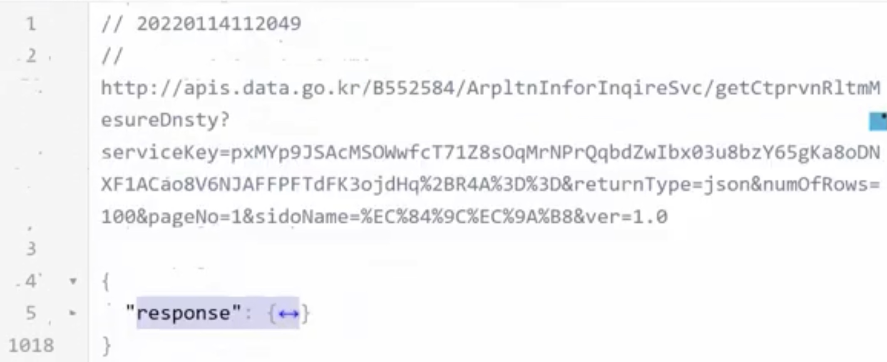
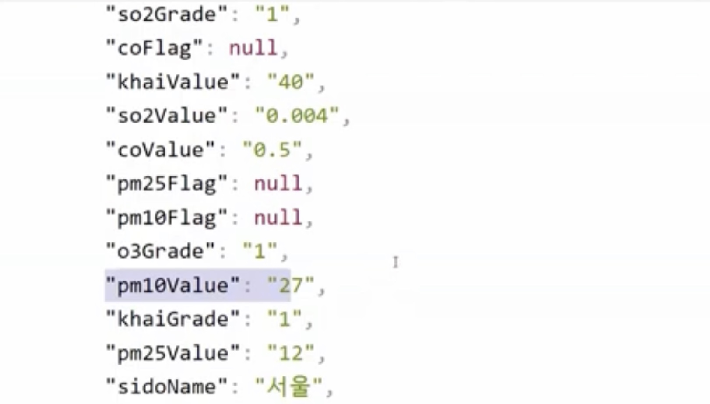
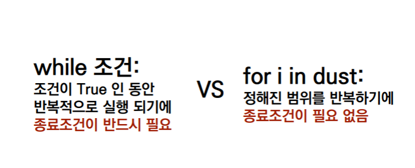
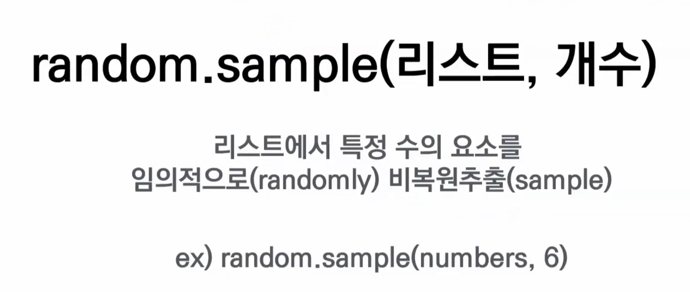
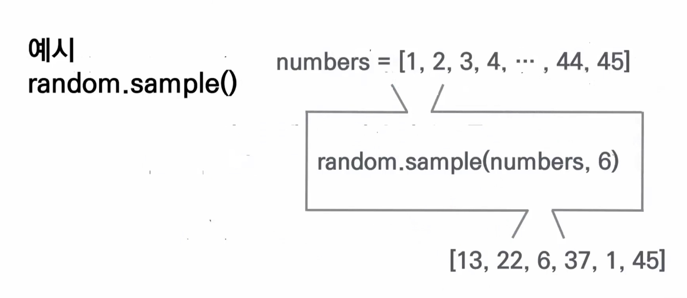
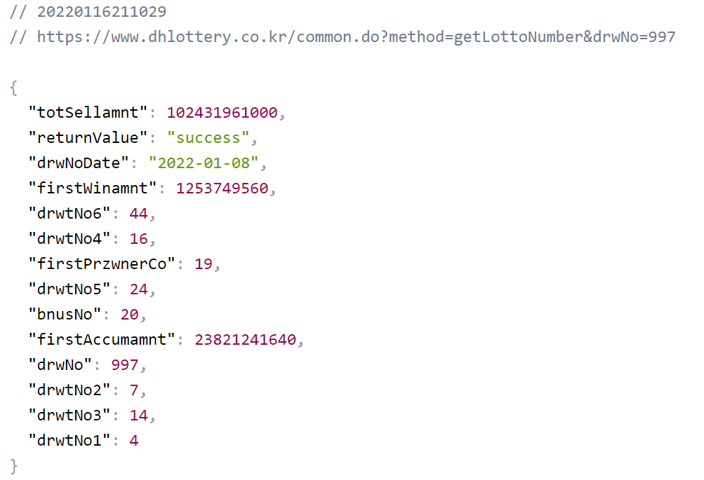
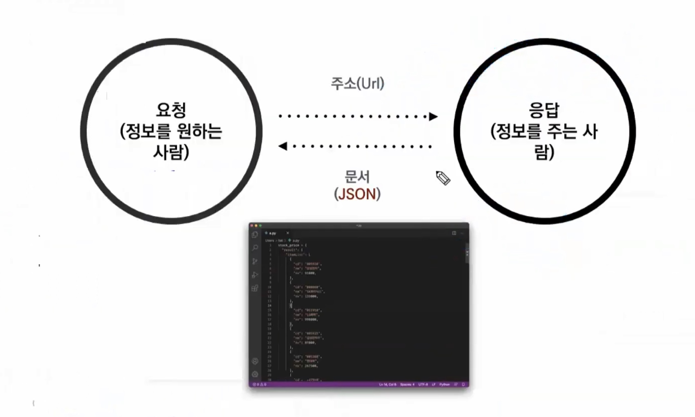

## SC. 텔레그램 봇 만들기

----

1. **파이썬 봇 검색**
2. **/start**
2. [Rorakim](https://py.hphk.io/bots)


### Greeting : 인사시키기

``` python
hello.py 생성

greeting = "Hello, World!"
print(greeting)
python hello.py

주의 : ls 했을 때 hello.py가 뜨는 위치에서 실행 
```

### Menu : 메뉴 추천 받기

```python
*List로 만들기*

menu = ['짜장면', '짬뽕', '탕수육']

print(menu)
```

``` python
*Dictionary로 만들기*

menu = {"새마을식당 : 1234-1234", "홍콩반점 : 3455=3456"}

print(menu)
```

``` python
*랜덤하게 추천 받기*
#import 가지고 오는 행위 
#이 이후로 활용할 코드를 가지고 올 것이기 때문에 
#import는 항상 최 상단에 작성한다.

import random

menu = ['짜장면', '짬뽕', '탕수육']

choice = random.choice(menu)
#random.choice = ()안의 변수 중 무작위 추출
print(choice)
```


### Dust : 미세먼지 지수 알려주기

``` 	python
dust = 70

if 150 < dust:
    print("매우나쁨")
elif 80 < dust <= 150:
    print("나쁨")
elif 30 < dust <= 80:
    print("보통")
else:
    print("좋음")   
```

```python
#요청을 보내는 방법
import requests
#아래의 모듈이 내 컴퓨터에 저장되어 있어야 실행 가능
from bs4 import BeautifulSoup

# 공공데이터 포탈 API에서 나를 인식하는 KEY
KEY = 'pxMYp9JSAcMSOWwfcT71Z8sOqMrNPrQqbdZwIbx03u8bzY65gKa8oDNXF1ACao8V6NJAFFPFTdFK3ojdHq%2BR4A%3D%3D'

#어느 포탈?
url = f'http://apis.data.go.kr/B552584/ArpltnInforInqireSvc/getCtprvnRltmMesureDnsty?serviceKey={KEY}&numOfRows=10&pageNo=3&sidoName=서울&ver=1.0'
# print(url)
# request에 의해 실행된 url을 가지고 와서 그 중 text만 뽑겠다.이걸 response 변수에 담겠다. 
response = requests.get(url).text

#Beautiful Soup : 파이썬이 읽을 수 없는 걸 읽을 수 있게 바꿔줌
#파이썬이 읽을 수 없는 xml에 담겨온 자료를 변환해 data에 담음
data = BeautifulSoup(response, 'xml')
# print(data)
item = data('item')[7]
time = item.dataTime.text
station = item.stationName.text
dust = int(item.pm10Value.text)

print(f'{time} 기준 {station}의 미세먼지 농도는 {dust} 입니다.')
```



딕셔너리 = {"문자열 : ", "문자열 : "}



```python
#f'의 의미 
print(f'{dust}따옴표로 감싸서 사용한다')
print('따옴표로 감싸서 사용한다.'.format(dust))

print('따옴표')
print('f{}따옴표')
{}에는 내가 넣고싶은 변수 명
= 출력시 변수에 담긴 값과 뒤의 문자열이 한번에 출력됨

```



### Greeting : while 활용해서 인사 4번 하기

``` python
#while
#종료될 조건이 필요
변수가 가진 값이 4미만인 동안 실행된다 
count = 0 
while count <4:
#조건을 만족하는 동안 아래 코드를 실행
    print(greeting)
    count = count + 1
```


### Greeting : for 활용해서 인사 4번 하기

``` bash
#for
#정해진 범위 안에서 반복 실행
#범위는...어디서구하나?
#i = 임시변수

for i in range(4):
	print(greeting)
```

### Lotto : 비복원추출로 로또 번호 추천받기





``` python
#1~45의 숫자 범위 만들기 근데 이렇게 하면?
numbers = range(1,46)
print(numbers)
#결과 
range(1,46) 출력됨 

#숫자 형태로 출력되게 하려면? 리스트로 만들기
numbers = list(range(1,46))
```

``` python
#1~45 중에 6개만 뽑아서 리스트에 담아서 출력
#random 불러오기
import random

#1~45의 숫자 범위 리스트로 만들기 
numbers = list(range(1,46))

#비복원추출로 6개 뽑기
lotto = random.sample(numbers,6)
print(lotto)

#결과 
[13, 39, 28, 35, 36, 17]
```


### Lotto : 당첨이 되려면 몇번 사야할까?

``` python
import random
winners = [4,7,14,16,24,44]
#1~45의 숫자 범위 리스트로 만들기 
numbers = list(range(1,46))

#비복원 추출로 6개 뽑기 
#6개 뽑아서 lotto변수에 담기를 1000번 반복
for i in range(1000):
    lotto = random.sample(numbers, 6)
    #print(lotto[0]~[5])
    #임시변수 num 설정하고 print
    for num in lotto:
        print(num)
        
#결과        
35
23
12
3
42
4
```

``` bash
import random
winners = [4,7,14,16,24,44]

numbers = list(range(1,46))

for i in range(10000000):
    lotto = random.sample(numbers, 6)
    #당첨 횟수를 기록 - 매번 0으로 초기화 필요
    count = 0
    for num in lotto:
    #lotto가 가지고 있는 값들 하나 하나가 
        #winners에 들어있다면
        if num in winners:
          #한개 당첨
            count = count + 1
    #숫자 6개를 다 확인하고 나서
    #6개 당첨 == 1등
    if count == 6:
        print(i)
        print('1등!!!!!') 
```


### Lotto.api : 이번주 당첨 번호는?

**1. 정보가 있는 api URL을 확인한다.**

[로또 api](https://www.dhlottery.co.kr/common.do?method=getLottoNumber&drwNo=997)




**2. URL로 요청을 보낸다.**



```bash
#pip 다운받기
$ pip install requests

$ pip list
requests 있는지 확인

response = request.get(url).json()
```

**3. 응답 결과를 확인하고 정보를 찾는다.**

```bash
print(response)
```

``` python
#requests 불러오기
import requests

#requests 사용해서 로또 api에 데이터 요청
url = 'https://www.dhlottery.co.kr/common.do?method=getLottoNumber&drwNo=997'
response = requests.get(url)

# 요청 보내서 응답 받은 문서를 출력
print(response)

#결과
#정상적으로 요청을 보냈다는 코드 
<Response [200]>
```

##### .json()을 붙여 변환해주자

``` python
#requests 불러오기
import requests

#requests 사용해서 로또 api에 데이터 요청
url = 'https://www.dhlottery.co.kr/common.do?method=getLottoNumber&drwNo=997'
response = requests.get(url).json()

# 요청 보내서 응답 받은 문서를 출력
print(response)
#당첨번호 정보를 리스트에 담아보자.
winners = []
#1~7까지 반복
for num in range(1, 7):
    print(response[f'drwtNo{num}'])
    #winners 리스트에 당첨번호 추가
    winners.append(response[f'drwtNo{num}'])
print(winners)
```


## 실습 : api로 무작위 나이 가져오기 

[나이 api](https://api.agify.io/?name={name})

``` python
from asyncio.proactor_events import _ProactorBaseWritePipeTransport
import requests
# 나이 예측 api 사용
name = input('이름을 입력해 주세요 : ')
url = f'https://api.agify.io/?name={name}'
# 특정 이름을 입력했을 때, 무작위 나이를 가져와서
response = requests.get(url).json()

age = response['age']
# ~~의 나이는 ~~살 입니다. 라는 문자를 출력
print(f'{name}의 나이는 {age}살 입니다.')
```


[날씨 api](https://www.metaweather.com/api/)

