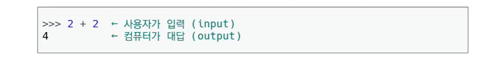

## Computer : calculation + remember

## Programming : Program(일련의 명령어의 모음,집합)

#### 언어란?

- 자신의 생각을 나타내고 전달하기 위해 사용하는 체계-
- 문법적으로 맞는 말의 집합

- 언어공동체에서 이해될 수 있는 말의 집합

#### 선언적 지식과 명령적 지식

선언적 지식(declarative Knowledge) - 사실에 대한 내용

명령적 지식(imperative knowledge) - 'How-to', 레시피

##### 과자를 먹이기 위한 how to? 생각보다 더 디테일한 how-to를 필요로함.

# 목차

----

- 파이썬 개발환경
- 기초 문법
- 자료형
  - Boolean Type
  - Numeric Type
  - String Type

- 컨테이너

---

## 파이썬이란?

- #### Easy to learn

  - 다른 프로그래밍 언어보다 문법이 간단하면서도 엄격하지 않음
    - 예시 : 변수에 별도의 **타입 지정**이 필요 없음.

  - 문법 표현이 매우 간결하여 프로그래밍 경험이 없어도 짧은 시간 내에 마스터할 수 있음
    - 예시 : 문장을 구분할 때 중괄호({,})대신 **들여쓰기** 사용

- #### Expressive Language

  - 같은 직업에 대해서도 C나 자바로 작성할 때 보다 더 간결하게 작성 가능 

    

- #### 크로스 플랫폼 언어

  - 윈도우즈, MacOS, 리눅스, 유닉스 등 다양한 운영체제에 사용

    

- #### 인터프리터 언어

  - 소스코드를 기계어로 변환하는 컴파일 과정 없이 바로 실행 가능 
  - 코드를 대화하듯 한 줄 입력하고 실행한 후, 바로 확인할 수 있음

  

- #### 객체 지향 프로그래밍 
  
  - 파이썬은 **객체지향 언어** 이며, 모든 것이 객체로 구현되어 있음. 
    - **객체(object)** : 숫자, 문자, 클래스 등 값을 가지고 있는 모든 것 

----

## 파이썬 개발환경

#### 파이썬 개발환경 종류

- #### 대화형 환경
  
  - 파이썬 기본 Interpreter
  
  - Jupyter Notebook(실습용)
  
    
  
- #### 스크립트 실행 (평가, 관통 프로젝트)
  
  - .py 파일을 작성하고, IDE(Pycharm : 알고리즘, 통합개발환경) 혹은 Text Editor(VS code : 코딩, 웹개발) 활용
    - 파이썬 프로그램 파일의 확장자명 : .py

----

## 파이썬 기본 인터프리터 : IDLE

- IDLE(intergrated Development and Learning Environment)

  통합 개발 환경의 약자,알고리즘  (Pycharm)

  - 내장 프로그램으로 파이썬 설치 시 기본적으로 설치 -> 인터프리터가 대화형 모드로 동작함 
    - 여러 줄의 코드가 작성되는 경우 보조 프롬프트(...)가 사용됨
    - 프롬프트(>>>)에 코드를 작성하면 해당 코드가 실행됨 
  
  - python이 설치된 환경에서는 기본적으로 활용 가능하나 디버깅 및 코드 편집, 반복 실행이 곤란

  

## Jupyter Lab : IDLE의 확장판

- 웹 브라우저 환경에서 코드를 작성할 수 있는 오픈 소스
  - Syntax Highlighting, Indentation, Tab completion 등 편의 기능 제공함
  - 브라우저에서 코드를 실행하고 결과를 확인할 수 있음
  - HTML, LaTeX,PNG,SVG을 바탕으로 다양한 표현이 가능
  - Markdown을 기반으로 문서를 작성할 수 있음

- ##### 데이터분석/머신러닝/딥러닝 시 많이 활용 가능하며, Google colab등 유사한 환경의 서비스도 있음.

-----

### Python 스크립트 실행

- IDE(ex.파이참), Text editior(ex. VS Code)등에서 작성한 파이썬 스크립트 파일을 직접 실행
- Text editor에서도 다양한 Extenstion을 이용해 IDE의 기능들을 사용해볼 수 있다.

### Python 수업 

- 알고리즘 : Pycharm

- 코딩

  - 파이썬 : Jupyter Notebook & Visual Studio Code
    - 실시간으로 결과 확인하며 학습하기 위함

  - 웹 : Visual Studio Code
    - HTML/CSS, Django, Javascript, Vue등 모두 개발하기 편한 환경

----

