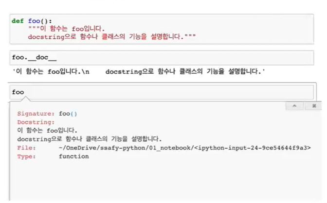

## 기초 문법 

### 코드 스타일 가이드

코드를 어떻게 작성할지에 대한 가이드라인

PEP8 을 지켜 일관적인 코드 작성스타일을 가지자!

#### 들여쓰기(indentation)

- Space Sensitive
  - 문장을 구분할 때, 중괄호 ({,}) 대신 <들여쓰기(indentation)> 사용
  
  - 들여쓰기를 할 때는 4칸(space 4번) 혹은 1탭(Tab 키 1번)을 입력 
    - 주의! 한 코드 안에서는 반드시 한 종류의 들여쓰기를 사용 - 혼용 금지
    
    - Tab으로 들여쓰면 계속 탭으로 들여써야 함
    
    - 원칙적으로는 공백(빈칸, space)사용을 권장* PEP8 권장사항
    
      

---


## 변수

#### 변수란?

- 컴퓨터 메모리 어딘가에 저장되어 있는 객체를 참조하기 위해 사용되는 이름

  - 객체(Object) : 숫자, 문자, 클래스 등 값을 가지고 있는 모든 것 

    -> 파이썬은 **객체지향 언어**이며, 모든 것이 객체로 구현되어 있음.

- 동일 변수에 다른 객체를 언제든 할당 할 수 있기 때문에, 즉 참조하는 객체가 바뀔 수 있기 때문에 '변수'라고 불림

- 변수는 할당 연산자(=)를 통해 값을 할당(assignment)
- type()
  - 변수에 할당된 값의 타입 

- id()

  - 변수에 할당된 값(객체)의 고유한 아이덴티티 값이며 메모리주소


``` python
x = 'ssafy'
print(type(x)) #<class 'str'>
print(id(x)) #2836300596208
```


``` python
i = 5
j = 3
s = '파이썬'
```

``` python
i + j #8
```

``` python
i = i - j 
i #2
```

``` python
'안녕'+s

#안녕파이썬
```

``` python
s = s * 3
s

#파이썬파이썬파이썬
```

``` python
j = -2
i * j

# -4
```

``` python
i * j / 3

#5.0
```

``` python
s = 'Python'
s + ' is fun'

#python is fun
```

----


## 변수 할당

- 같은 값을 동시에 할당할 수 있음

``` python
x = y = 1004
print(x,y) # 1004 1004

x, y = 1, 2
print(x, y) # 1 2

x, y = 1 # TypeError: cannot unpack non-iterable int object
x, y = 1, 2, 3 #ValueError: too many values to unpack (expected 2)
```


``` python
#각각의 값을 바꿔서 저장하는 코드를 작성하라
x, y = 10, 20 

#임시 변수 활용
tem = x
x = y
y = tem 
print(x, y)

#Pythonic!
x, y = 10, 20 
y, x = x, y
print(x, y)
```

----


### 식별자(Identifiers)

- 변수(박스)의 이름을 어떻게 지을 수 있을까?

- 파이썬 객체(변수, 함수, 모듈, 클래스 등)를 식별하는데 사용하는 이름(name)

- 규칙

  - 식별자의 이름은 영문 알파벳, 언더스코어(_), 숫자로 구성

    - 변수와 함수의 이름은 snakecase로 작성(red_apple)

  - 첫 글자에 숫자가 올 수 없음 

  - 길이제한이 없고 대소문자를 구별

  - 내장함수나 모듈 등의 이름으로도 만들면 안됨

    - 기존의 이름에 다른 값을 할당하게 되므로 더 이상 동작하지 않음
  
    ``` python
    print(5) #5
    print = 'hi'
    print(5) #TypeError: 'str' object is not callable
    ```
    
    
    
  - 다음의 키워드(Keywords)는 예약어(reserved words)로 사용할 수 없음 
  
    ``` python
    import keyword
    print(keyword.kwlist)
    
    ['False', 'None', 'True', '__peg_parser__', 'and', 'as', 'assert', 'async', 'await', 'break', 'class', 'continue', 'def', 'del', 'elif', 'else', 'except', 'finally', 'for', 'from', 'global', 'if', 'import', 'in', 'is', 'lambda', 'nonlocal', 'not', 'or', 'pass', 'raise', 'return', 'try', 'while', 'with', 'yield']['False', 'None', 'True', '__peg_parser__', 'and', 'as', 'assert', 'async', 'await', 'break', 'class', 'continue', 'def', 'del', 'elif', 'else', 'except', 'finally', 'for', 'from', 'global', 'if', 'import', 'in', 'is', 'lambda', 'nonlocal', 'not', 'or', 'pass', 'raise', 'return', 'try', 'while', 'with', 'yield']
    ```
    
  

-----


### 사용자 입력

- input([prompt])
  - 사용자로부터 값을 즉시 입력 받을 수 있는 내장함수
  - 대괄호 부분에 문자열을 넣으면 입력 시, 해당 문자열을 출력할 수 있음.
  - 반환값은 항상 문자열의 형태로 변환

``` python
name = input('이름을 입력해주세요 : ') #이름을 입력해주세요 : 김싸피 
print(name) #김싸피
type(name) #str
```

---


### 주석(Comment)

- 한 줄 주석
  - 주석으로 처리될 내용 앞에 '#'을 입력
    - 한 줄을 온전히 사용할 수도 있고, 그 줄 코드 뒷부분에 작성 할 수 있음 
    - VS Code에서 `ctrl + /`사용해서 일괄 주석 가능

``` python
#이름을 출력합니다.
print('SSAFY KIM')
print('SSAFY KIM') # 이름을 출력합니다. 
```

- 여러 줄의 주석 

  - 한 줄씩 #을 사용하거나, """또는 '''으로 표현 

    - """ 또는 '''으로 표현하는 방법은 docstring을 위해 사용

      

- 특수한 형태의 주석

  - 함수/클래스의 설명을 작성 

  


