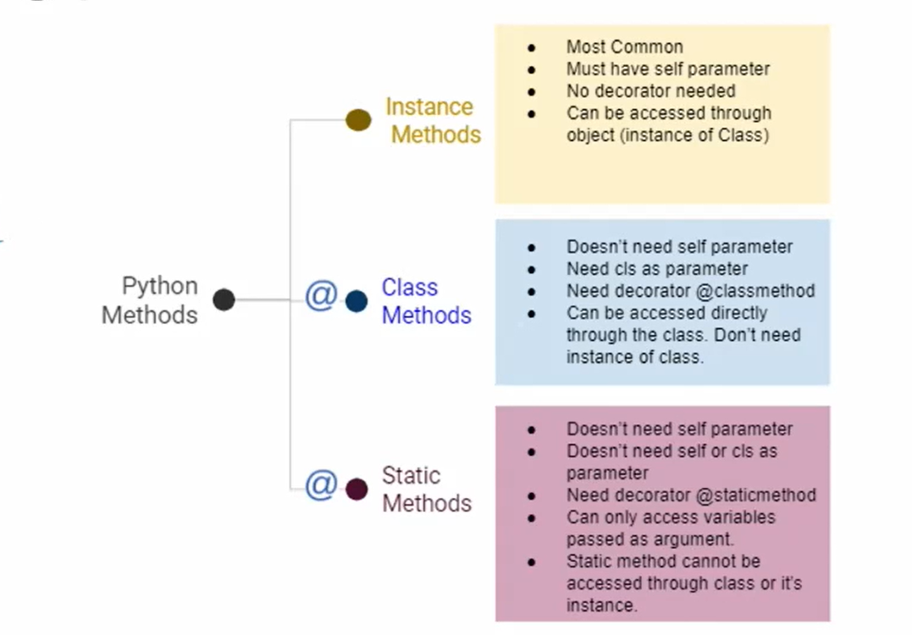

### 메소드 정리 

- 인스턴스 메소드
  - 호출한 인스턴스를 의미하는 self 매개 변수를 통해 인스턴스 조작
- 클래스 메소드
  - 클래스를 의미하는 cls 매개 변수를 통해 클래스를 조작

- 스태틱 메소드

  - 인스턴스나 클래스를 의미하는 매개변수는 사용하지 않음.
    - 즉 객체 상태나 클래스 상태를 수정할 수 없음.

  - 일반 함수처럼 동작하지만 클래스의 이름공간에 귀속됨.
    - 주로 해당 클래스로 한정하는 용도로 사용.

  ``` python
  class MathUtility:
      
      @staticmethod
      def get_pi():
          return 3.141592
      
      @staticmethod
      def get_e():
          return 2
      
  MathUtility.get_pi() #3.141592
  MathUtility.get_e() #2
  ```

  ``` python
  class PersonUtility:
      
      @staticmethod
      def get_phone_number(phone_number):
          return phone_number[:2] + ')' + phone_number[2:]
      
  PersonUtility.get_phone_number('023443214')
  # 02)3443214
  ```

  

---

# OOP의 핵심 개념

- 추상화 (Abstraction)
- 상속 (Inheritance)
- 다형성 (Polymorphism)
- 캡슐화 (Encapsulation)


## 추상화(Abstraction)란?

- 객체 지향 프로그래밍에서의 추상화는 세부적인 내용은 감추고 필수적인 부분만 표현하는 것을 뜻합니다.
- 현실 세계를 프로그램 설계에 반영하기 위해 사용됩니다.
- 여러 클래스가 공통적으로 사용할 속성 및 메서드를 추출하여 기본 클래스로 작성하여 활용합니다.
- Person은 Professor와 Student로 분류된다. 같은 사람인데 이 안에서 class를 나눠볼 수 있다. 각각 다른형태로 설계해서 추상화 할 수 있다. 

``` python
# 학생(Student)을 표현하기 위한 클래스를 생성합니다.

class Student:
    
    def __init__(self, name, age, gpa):
        self.name = name
        self.age = age
        self.gpa = gpa
    
    def talk(self):
        print(f'반갑습니다. {self.name}입니다.')
        
    def study(self):
        self.gpa += 0.1
```

``` python
# 교수(Professor)를 표현하기 위한 클래스를 생성합니다.

class Professor:
    
    def __init__(self, name, age, department):
        self.name = name
        self.age = age
        self.department = department
        
    def talk(self):
        print(f'반갑습니다. {self.name}입니다.')
        
    def teach(self):
        self.age += 1
```

``` python
# 학생 클래스와 교수 클래스의 공통 속성과 행위(메서드)를 추출하여, 
# Person이라는 클래스를 통해 추상화를 해봅시다.

class Person:
    
    def __init__(self, name, age):
        self.name = name
        self.age = age 
    
    def talk(self):
        print(f'반갑습니다. {self.name}입니다.')
```

-----


## 상속

- 두 클래스 사이에 부모- 자식 관계를 정립하는 것
- 클래스는 상속이 가능함
  - 모든 파이썬 클래스는 object로 부터 상속됨

- 부모 클래스의 모든 요소(속성, 메소드)가 상속됨
- super()를 통해 부모 클래스의 요소를 호출할 수 있음
- 메소드 오버라이딩을 통해 자식 클래스에서 재정의 가능함
- 상속관계에서의 이름 공간은 인스턴스, 자식 클래스, 부모 클래스 순으로 탐색

``` python
class ChildClass(ParentClass):
```

- 하위 클래스는 상위 클래스에 정의된 속성, 행동, 관계 및 제약 조건을 모두 상속 받음
- 부모 클래스의 속성, 메소드가 자식 클래스에 상속되므로, 코드 재사용성이 높아짐
- 상속을 통한 메소드 재사용

``` python
class Person:
    
    def __init__(self, name, age):
        self.name = name
        self.age = age
        
    def talk(self):
        print(f'반갑습니다, {self.name}입니다.')
  
p1 = Person('윤경', 30)
p1.talk()

#반갑습니다, 윤경입니다.
```

``` python
class Professor:
    
    def __init__(self, name, age, department):
        self.name = name
        self.age = age
        self.deparment = department

prof1 = Professor('김교수', 50, '컴공')
prof1.talk()
# AttributeError: 'Professor' object has no attribute 'talk'

없는데..? 너 talk이라는거 professor에 정의한적 없쟈나
선언을 안했으니까.. 
Professor가 Person의 한 종류라는건 맞지만 좀 더 다른내용으로 구성하고 싶다.
```

``` python
class Professor(Person):
    
    def __init__(self, name, age, department):
        self.name = name
        self.age = age
        self.deparment = department
        
prof1 = Professor('김교수', 50, '컴공')
prof1.talk()
#반갑습니다, 김교수입니다.
```

```python
class Student(Person):
    
    def __init__(self, name, age, gpa):
        self.name = name
        self.age = age
        self.gpa = gpa
        
    def talk(self):
        print(f'{self.name}입니다. 교수님. ^^7')
        
s1 = Student('승운', 20, 4.5)
s1.talk()
#승운입니다. 교수님. ^^7
```

----


#### 상속 관련 함수와 메소드

- ### **isinstance(object, classinfo)**
  
  - classinfo의 instance거나 subclass*인 경우 True

``` python
class Person:
    pass

class Student(Person):
    pass

class Professor(Person):
    pass

p1 = Person()
s1 = Student()
prof1 = Professor()

isinstance(p1, Person) #True
isinstance(s1, Person) #True
isinstance(p1, Student) #False
```


- ### **issubclass(class, classinfo)**
  
  - class가 classinfo의 subclass면 True
  - classinfo는 클래스 객체의 튜플일 수 있으며, classinfo의 모든 항목을 검사

``` python
issubclass(Student, Person) #True
issubclass(bool, int) #True
issubclass(float, int) #False
issubclass(int, float) #False
issubclass(Professor, Student) #False
```

- ### **super()**
  
  - 자식클래스에서 부모클래스를 사용하고 싶은 경우

```  python
class Person:
    
    def __init__(self, name, age):
        print('진짜 호출되냐')
        self.name = name
        self.age = age
        
    def talk(self):
        print(f'반갑습니다, {self.name}입니다.')
        
class Student(Person):
    
    def __init__(self, name, age, student_id):
        super().__init__(name, age)
        self.student_id = student_id
        
s1 = Student('영주', 26, '20220101') #진짜 호출되냐

s1.name #영주
s1.age #26
```

-----


## 상속 정리 

- 파이썬의 모든 클래스는 object로부터 상속됨
- 부모 클래스의 모든 요소(속성, 메소드)가 상속됨
- super()를 통해 부모 클래스의 요소를 호출할 수 있음
- 메소드 오버라이딩을 통해 자식 클래스에서 재정의 가능함
- 상속 관계에서의 이름 공간은 인스턴스, 자식 클래스, 부모 클래스 순으로 탐색

----


### 상속, 클래스메서드

``` python
class Person:
    population = 0
    
    @staticmethod
    def add_population():
        Person.population += 1
        
Person.add_population()
print(Person.population) 

#값 = 실행할 때 마다 1씩 증가

class Student(Person):
    population = 0
    
Student.add_population()
print(Student.population)
#값 0 
#증가가 안됨
```

``` python
class Person:
    population = 0
    
    @classmethod
    def add_population(cls):
        cls.population += 1
        
class Student(Person):
    population = 0
    
Person.add_population()
print(Person.population) #값 1

Student.add_population()
print(Student.population) #값 1
```

-----


### 다중 상속

- 두개 이상의 클래스를 상속 받는 경우
- 상속 받은 모든 클래스의 요소를 활용 가능함
- 중복된 속성이나 메서드가 있는 경우 상속 순서에 의해 결정됨


#### 다중 상속일때는 먼저 상속받는 것에 영향을 받는다. 

``` python
class Person:
    def __init__(self, name):
        self.name = name
        
    def greeting(self):
        return f'안녕, {self.name}'

class Mom(Person):
    gene = 'XX'
    
    def swim(self):
        return '엄마가 수영'

class Dad(Person):
    gene = 'XY'
    
    def walk(self):
        return '아빠가 걷기'

class FirstChild(Dad, Mom):
    def swim(self):
        return '첫째가 수영'
    
    def cry(self):
        return '첫째가 응애'

baby1 = FirstChild('아가')
print(baby1.cry()) #첫째가 응애 
print(baby1.swim()) #첫째가 수영
print(baby1.walk()) #아빠가 걷기 
print(baby1.gene) #XY
```

``` python
baby1 = Firstchild('아가')
baby1.cry() #첫째가 응애 
baby1.swim() #첫째가 수영
baby1.walk() #아빠가 걷기 
baby1.gene #XY
```


- #### mro 메소드(Method Resolution Order)

  - 해당 인스턴스의 클래스가 어떤 부모 클래스를 가지는지 확인하는 메소드
  - 기존의 인스턴스 -> 클래스 순으로 이름 공간을 탐색하는 과정에서 상속 관계에 있으면 인스턴스 -> 자식 클래스 -> 부모 클래스로 확장 

``` python
FirstChild.mro()

#[<class '__main__.FirstChild'>, <class '__main__.Dad'>, <class '__main__.Mom'>, <class '__main__.Person'>, <class 'object'>]

#mom보다 dad가 더 먼저나와있는 것을 확인
```

----


### 다형성

- 다형성이란?

  - 여러 모양을 뜻하는 그리스어

  - 동일한 메소드가 클래스에 따라 다르게 행동할 수 있음을 의미

  - 즉, 서로 다른 클래스에 속해있는 객체들이 동일한 메세지에 대해 다른 방식으로 응답될 수 있음.

    

- 메소드 오버라이딩

  - 상속 받은 메소드를 재정의 
    - 클래스 상속 시, 부모 클래스에서 정의한 메소드를 자식 클래스에서 변경
    - 부모 클래스의 메소드 이름과 기본 기능은 그대로 사용하지만, 특정 기능을 바꾸고 싶을 때 사용

  - 부모 클래스의 메소드를 실행시키고 싶은 경우 super를 활용

``` python
class Person:
    def __init__(self, name):
        self.name = name

    def talk(self):
        print(f'반갑습니다. {self.name}입니다.')

class Professor(Person):
    def talk(self):
        print(f'{self.name}일세.')

class Student(Person):
    def talk(self):
        print(f'저는 학생입니다.')
```

``` python
p1 = Professor('김교수')
p1.talk() #김교수일세.

s1 = Student('이학생')
s1.talk() #저는 학생입니다.
```

----


## 캡슐화 

- 객체의 일부 구현 내용에 대해 외부로부터의 직접적인 액세스를 차단 
  - 예시 : 주민등록번호

- 파이썬에서 암묵적으로 존재하지만, 언어적으로는 존재하지 않음

``` python
class Person:
    pass

p1 = Person()
p1.name = '원우'
print(p1.name)

#이렇게 하면 값을 직접 바꾸는 것이 가능
```

``` python
class Person:
 
    def get_name(self):
        return self.name

    def set_name(self, name):
        self.name = name

p2 = Person()
p2.set_name('로라')
print(p2.get_name())

# 직접 값을 바꾸지 못하게 함. 보안에 더 철저. 
```

---


### 접근 제어자 종류 

- Public Access Modifier
  - 누구든 접근 할 수 있음
- Protected Access Modifier
  - 암묵적인 규칙에 의해 부모 클래스 내부와 자식 클래스에서만 호출 가능
- Private Access Modifier
  - 본 클래스 내부에서만 사용이 가능 

---


#### Public Member

- 언더바 없이 시작하는 메소드나 속성
- 어디서나 호출이 가능, 하위 클래스 override 허용
- 일반적으로 작성되는 메소드와 속성의 대다수를 차지

``` python
class Person:
    def __init__(self, name):
        self.name = name
```


#### Protected Member

- 언더바 1개로 시작하는 메소드나 속성
- 암묵적 규칙에 의해 부모 클래스 내부와 자식 클래스에서만 호출 가능
- 하위 클래스 override 허용

``` python
class Person:
    def __init__(self, name):
        self.name = name
        self._age = age
        
    def get_age(self):
        return self._age

p1 = Person('김싸피', 30)
p1.get_age() #30
    
#_age에 직접 접근하여도 확인이 가능하다.
#파이썬에서는 암묵적으로 활용될 뿐이다. 
p1._age #30
```


#### Private Member

- 언더바 2개로 시작하는 메소드나 속성 
- 본 클래스 내부에서만 사용이 가능
- 하위클래스 상속 및 호출 불가능(오류)
- 외부 호출 불가능(오류)

``` python
class Person:
    def __init__(self, name, age):
        self.name = name
        self.__age = age
        
    def get_age(self):
        return self.__age

p1 = Person('김싸피', 30)
p1.get_age() #30

#_age에 직접 접근 불가
p1.__age
# AttributeError: 'Person' object has no attribute '__age'
#p1.get_age()만 가능
```

----


### getter 메소드와 setter 메소드

- 변수에 접근할 수 있는 메소드를 별도로 생성

  - getter 메소드 : 변수의 값을 읽는 메소드
    - @property 데코레이터 사용

  - setter 메소드 : 변수의 값을 설정하는 성격의 메소드
    - @변수.setter 사용

#### getter 메소드

``` python
class Person:
    
    def __init__(self, age):
        self._age = age
    
    #앞으로 age()라고 부를 필요 없이 속성처럼 .age로 부르게 해주는 메서드
    @property
    def age(self):
        return self._age
    
    #_age는 암묵적으로 직접 변경하지 않기로 되어있기 때문에 
    #'.age = '형식으로 값이 주어지면 setter가 실행되도록 조건을 걸었다
    @age.setter
    def age(self, new_age):
        if new_age <= 19:
            raise ValueError('Too Young For SSAFY')
            return 
        
        self._age = new_age    
```

``` python
#Person의 인스턴스를 만들어서 나이에 접근하면 정상적으로 출력됩니다.

p1 = Person(20)
print(p1.age()) #TypeError 
print(p1.age) #20

#앞에 @property를 붙이니까 실제로는 method를 정의했는데 속성처럼 쓴다!!
```

``` python
#p1 인스턴스의 나이를 다른 값으로 바꿔도 정상적으로 반영됩니다.

p1.age = 33
print(p1.age) #33

#파이썬에서는 p1._age = 33
#print(p1._age) #33
#해도 작동이되지만,, 암묵적으로 그렇게 하지 말고 setter 사용하기로 되어있음
```

``` python
#setter 함수에는 "나이가 19살 이하면 안된다는" 조건이 있습니다.
#따라서 나이를 19살 이하인 값으로 변경하게 되면 오류가 발생합니다.

p1.age = 19
print(p1.age)
#ValueError: Too Young For SSAFY
```


#### ※그럼 @age.getter는 하면안되나? 됨!

``` python
class Person:
    
    def __init__(self, age):
        self._age = age
    
    @property
    def age(self):
        return self._age
    
    @age.setter
    def age(self, new_age):
        if new_age <= 19:
            raise ValueError('Too Young For SSAFY')
            return 
        
        self._age = new_age 
        
        
class Human(Person):
    #상속 받아서 다시 override하고싶을때는
    @Person.age.getter #@property헤도되지만 의미론적으로 차이 있음
    def age(self)
    print('this is Human')
    return self._age

hi = Human(30)
hi.age
#this is Human
```


### setter 메소드

``` python
class Person:
    
    def __init__(self, age):
        self._age = age
        
    @property
    def age(self):
        return self._age 
    @age.setter
    def age(self):
        self._age = self._age - 10
        
p1 = Person(40)
p1.age #40
```

``` python
p1.age = 30
```

